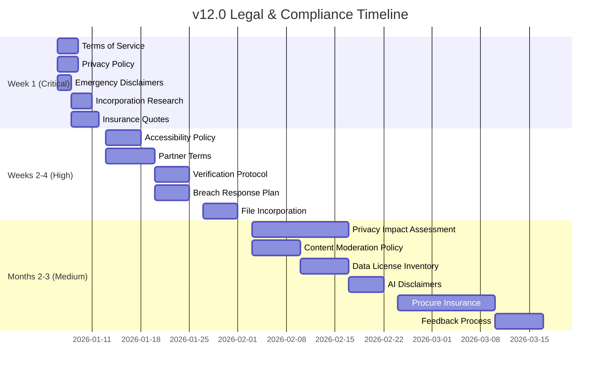

# Roadmap v12.0: Legal & Compliance Infrastructure

> **Status**: In Planning
> **Focus**: Establish fundamental legal protections, regulatory compliance, and liability mitigation
> **Constraints**: Completely free, solo dev + AI assistance, pro bono legal support where possible
> **Methodology**: Based on comprehensive legal/liability evaluation identifying 12 risk areas

---

## Executive Summary

This roadmap addresses **critical legal infrastructure gaps** that currently expose Kingston Care Connect (KCC) and its organizers to significant liability. The platform serves vulnerable populations with crisis services, creating a heightened duty of care that requires robust legal protections.

> [!WARNING]
> **Critical Finding**: The platform currently operates without Terms of Service, comprehensive Privacy Policy, formal legal entity structure, or liability insurance. These gaps create significant personal liability exposure for organizers.

### Risk Level Summary

| Priority | Risks | Timeline |
|:---------|:------|:---------|
| **Critical** | 5 risks | Week 1 |
| **High** | 4 risks | Weeks 2-4 |
| **Medium** | 3 risks | Months 2-3 |

### Budget Summary

| Type | Low | High |
|:-----|:----|:-----|
| One-Time Costs | $7,500 | $20,000 |
| Annual Recurring | $4,500 | $11,500 |

---

## Goal

Establish legal and compliance infrastructure that:

1. **Protects Organizers**: Shield individuals from personal liability through incorporation and insurance
2. **Mitigates User Claims**: Implement enforceable Terms of Service and disclaimers
3. **Ensures Regulatory Compliance**: Meet PIPEDA, AODA, and PHIPA requirements
4. **Documents Due Diligence**: Create audit trails for verification processes
5. **Prepares for Scale**: Build framework that supports partnerships and funding applications

---

## Design Decisions

### Legal Entity: Ontario Non-Profit Corporation

| Decision | Rationale |
|:---------|:----------|
| Provincial non-profit over federal | Simpler filing, lower cost, sufficient for Ontario-focused operations |
| Non-profit over registered charity | Faster to establish; charity status can be added later for tax receipts |
| Corporation over informal collective | Limited liability protection; required for insurance and funding |
| Board of Directors | Governance credibility; distributes responsibility; funding requirement |

**Why not remain informal?** Personal liability exposure for organizers is unacceptable given the vulnerable populations served. A single claim could result in financial ruin.

### Disclaimer Strategy: Layered Approach

| Decision | Rationale |
|:---------|:----------|
| Browse-wrap ToS + Click-wrap for partners | Maximum coverage for users; stronger enforceability for partners |
| Contextual disclaimers throughout site | More effective than single page; addresses specific risks at point of use |
| Emergency notices on every crisis page | Legal requirement for services that could delay emergency response |
| AI-specific disclaimers | Emerging regulatory landscape; proactive compliance |

**Why not just a single ToS page?** Canadian courts require disclaimers to be prominent and timely. Contextual disclaimers at point of use are more defensible.

### Privacy Approach: Documentation-First

| Decision | Rationale |
|:---------|:----------|
| Comprehensive Privacy Policy | PIPEDA compliance requires formal documentation regardless of actual data collection |
| Privacy Impact Assessment | Best practice; required for many funding sources; identifies hidden risks |
| Data Processing Agreements | Required for partner portal access to feedback data |
| Breach Response Plan | PIPEDA mandatory; proactive preparation prevents panic response |

**Why document when we collect minimal data?** Legal compliance is about demonstrable processes, not just technical implementation. Good architecture without documentation is indefensible.

---

## Phase 1: Critical Priority (Week 1)

### 1.1 Terms of Service

**Risk Addressed**: No limitation of liability; no user agreement

#### Implementation

**File**: `app/[locale]/terms/page.tsx`

Create Terms of Service page with the following sections:

```typescript
// Structure for Terms of Service
const termsSections = [
  {
    id: "acceptance",
    title: "Acceptance of Terms",
    content: `By accessing or using Kingston Care Connect ("KCC", "the Service"), 
    you agree to be bound by these Terms of Service. If you do not agree to 
    these terms, do not use the Service.`
  },
  {
    id: "service-description",
    title: "Description of Service",
    content: `KCC is an information directory that provides contact information 
    for social services in Kingston, Ontario. KCC does NOT provide:
    - Emergency services (for emergencies, call 911)
    - Medical advice or healthcare services
    - Legal advice or representation
    - Financial advice or services
    - Counseling or mental health treatment
    
    KCC is a directory only. We do not operate, control, or endorse any 
    services listed on this platform.`
  },
  {
    id: "disclaimer-warranties",
    title: "Disclaimer of Warranties",
    content: `THE SERVICE IS PROVIDED "AS IS" AND "AS AVAILABLE" WITHOUT 
    WARRANTIES OF ANY KIND, EITHER EXPRESS OR IMPLIED, INCLUDING BUT NOT 
    LIMITED TO:
    - Warranties of merchantability
    - Fitness for a particular purpose
    - Non-infringement
    - Accuracy, completeness, or timeliness of information
    
    WE DO NOT WARRANT THAT:
    - Service information is accurate, current, or complete
    - Services listed are available, safe, or appropriate for your needs
    - The platform will be uninterrupted or error-free
    - Defects will be corrected`
  },
  {
    id: "limitation-liability",
    title: "Limitation of Liability",
    content: `TO THE MAXIMUM EXTENT PERMITTED BY LAW, KINGSTON CARE CONNECT, 
    ITS ORGANIZERS, CONTRIBUTORS, AND AFFILIATES SHALL NOT BE LIABLE FOR:
    - Any indirect, incidental, special, consequential, or punitive damages
    - Damages for loss of profits, goodwill, use, data, or other intangibles
    - Any damages arising from your use of or inability to use the Service
    - Any damages arising from actions or omissions of listed services
    - Any damages exceeding $100 CAD in the aggregate
    
    YOU USE THIS SERVICE AT YOUR OWN RISK. You are solely responsible for 
    verifying information with service providers before relying on it.`
  },
  {
    id: "emergency-disclaimer",
    title: "Emergency Services Disclaimer",
    content: `THIS IS NOT AN EMERGENCY SERVICE. If you are experiencing:
    - A life-threatening emergency: CALL 911 IMMEDIATELY
    - A mental health crisis: CALL 988 (Suicide Crisis Helpline)
    - A domestic violence emergency: CALL 911 or your local shelter hotline
    
    Do not rely on this directory for emergencies. Information may be 
    outdated, incorrect, or unavailable.`
  },
  {
    id: "no-professional-advice",
    title: "No Professional Advice",
    content: `Nothing on this platform constitutes professional advice of any 
    kind, including but not limited to medical, legal, financial, or 
    psychological advice. Always consult qualified professionals for 
    specific concerns.`
  },
  {
    id: "user-responsibilities",
    title: "User Responsibilities",
    content: `By using KCC, you agree to:
    - Verify all information directly with service providers
    - Not rely solely on KCC information for critical decisions
    - Report inaccurate information through our feedback system
    - Use the Service only for lawful purposes
    - Not attempt to circumvent security measures`
  },
  {
    id: "indemnification",
    title: "Indemnification",
    content: `You agree to indemnify and hold harmless Kingston Care Connect, 
    its organizers, contributors, and affiliates from any claims, damages, 
    losses, or expenses (including reasonable legal fees) arising from:
    - Your use of the Service
    - Your reliance on information from the Service
    - Your violation of these Terms
    - Your violation of any third-party rights`
  },
  {
    id: "third-party-services",
    title: "Third-Party Services",
    content: `KCC lists third-party services over which we have no control. 
    We are not responsible for:
    - The availability, quality, or safety of listed services
    - Actions or omissions of listed service providers
    - Content on external websites linked from KCC
    - Experiences you have with listed services
    
    Inclusion in this directory does not constitute endorsement.`
  },
  {
    id: "ai-assistant",
    title: "AI Assistant Disclaimer",
    content: `Our AI assistant uses a language model that may:
    - Provide inaccurate or hallucinated information
    - Misunderstand your questions
    - Give outdated information
    - Fail unexpectedly
    
    The AI assistant is for informational purposes only. Always verify 
    critical information with service providers. For emergencies, call 
    911 immediately - the AI assistant cannot provide emergency assistance 
    and is not monitored in real-time.`
  },
  {
    id: "modifications",
    title: "Modifications to Terms",
    content: `We reserve the right to modify these Terms at any time. Changes 
    will be effective immediately upon posting. Your continued use of the 
    Service after changes constitutes acceptance of the modified Terms.
    
    Last Updated: [DATE]`
  },
  {
    id: "governing-law",
    title: "Governing Law and Jurisdiction",
    content: `These Terms shall be governed by and construed in accordance 
    with the laws of the Province of Ontario and the federal laws of Canada 
    applicable therein. Any disputes shall be resolved in the courts of 
    Ontario, and you consent to the exclusive jurisdiction of such courts.`
  },
  {
    id: "severability",
    title: "Severability",
    content: `If any provision of these Terms is found to be unenforceable, 
    the remaining provisions shall continue in full force and effect.`
  },
  {
    id: "contact",
    title: "Contact Information",
    content: `For questions about these Terms:
    Email: legal@kingstoncareconnect.ca
    
    For privacy concerns: privacy@kingstoncareconnect.ca
    For accessibility concerns: accessibility@kingstoncareconnect.ca`
  }
]
```

#### Translations

**File**: `messages/en.json` - Add Terms translations
**File**: `messages/fr.json` - Add French Terms translations

All terms content must be fully bilingual per AODA and project requirements.

#### Footer Link

Update `components/layout/Footer.tsx` to include Terms of Service link.

#### Testing

- E2E test: Verify Terms page loads and renders all sections
- Verify footer link works
- Verify bilingual content displays correctly

---

### 1.2 Privacy Policy

**Risk Addressed**: PIPEDA non-compliance; no formal privacy documentation

#### Implementation

**File**: `app/[locale]/privacy/page.tsx`

Expand existing privacy page with comprehensive PIPEDA-compliant content:

```typescript
const privacySections = [
  {
    id: "overview",
    title: "Privacy Policy Overview",
    content: `Kingston Care Connect ("KCC", "we", "us") is committed to 
    protecting your privacy. This policy explains how we collect, use, 
    and protect information when you use our service.
    
    Effective Date: [DATE]
    Last Updated: [DATE]`
  },
  {
    id: "data-collection",
    title: "Information We Collect",
    subsections: [
      {
        title: "Information You Provide",
        content: `
        - **Feedback Forms**: When you report issues with service listings, 
          we collect the information you provide (e.g., description of issue, 
          contact information if voluntarily provided).
        - **Partner Portal**: Partners who claim listings provide organization 
          name, contact information, and authentication credentials.
        - **Service Submissions**: Public submissions include service details 
          you provide.`
      },
      {
        title: "Information Collected Automatically",
        content: `
        - **Local Storage**: We store preferences (language, theme, 
          personalization settings) in your browser's localStorage. This 
          data never leaves your device.
        - **Technical Data**: Our hosting provider (Vercel) may collect 
          standard server logs (IP addresses, browser type, timestamps) 
          for security and performance purposes. We do not access or 
          analyze these logs for user tracking.`
      },
      {
        title: "Information We Do NOT Collect",
        content: `
        - We do NOT log search queries
        - We do NOT use tracking cookies
        - We do NOT use analytics services (Google Analytics, etc.)
        - We do NOT track your browsing behavior
        - We do NOT sell or share your data with advertisers
        - We do NOT collect sensitive health information
        
        For sensitive searches (crisis-related queries), we implement a 
        Zero-Log Policy - no query text, metadata, or identifiers are recorded.`
      }
    ]
  },
  {
    id: "ai-privacy",
    title: "AI Assistant Privacy",
    content: `Our AI assistant runs entirely in your browser using 
    client-side processing. This means:
    
    - **Zero Data Egress**: Your conversations and queries never leave 
      your device.
    - **No Server Processing**: The AI model downloads to your browser 
      and runs locally.
    - **Zero-Knowledge Architecture**: We know that you used the AI 
      assistant, but not what you discussed.
    - **Opt-In Only**: The AI model only downloads when you explicitly 
      choose to use the assistant.
    - **No Storage**: Conversations are not stored after you close the 
      browser.`
  },
  {
    id: "use-of-information",
    title: "How We Use Information",
    content: `We use collected information for:
    
    - **Service Improvement**: Feedback helps us correct inaccurate 
      listings and improve data quality.
    - **Partner Management**: Partner information enables the Partner 
      Portal functionality.
    - **Communication**: We may contact partners regarding their listings.
    - **Security**: Technical data helps protect against abuse.
    
    We do NOT use your information for:
    - Advertising or marketing
    - Profiling or behavioral tracking
    - Sale to third parties`
  },
  {
    id: "data-sharing",
    title: "Information Sharing",
    content: `We share information only:
    
    - **With Partners**: User feedback about a service is shared with 
      the verified partner who manages that listing.
    - **With Service Providers**: We use:
      - Supabase (database hosting) - for partner portal data
      - Vercel (website hosting) - for website delivery
      - Twilio (phone validation) - for service verification (your data 
        is not shared)
    - **Legal Requirements**: We may disclose information if required by 
      law, court order, or government request.
    
    We do NOT sell your information. We do NOT share information with 
    advertisers.`
  },
  {
    id: "data-retention",
    title: "Data Retention",
    content: `
    - **Feedback**: Retained until the issue is resolved, then deleted 
      within 90 days.
    - **Partner Data**: Retained while the partnership is active; deleted 
      upon request or account closure.
    - **Local Storage**: Controlled by you; clear your browser data to 
      remove.
    - **Server Logs**: Managed by Vercel per their retention policy 
      (typically 30 days).`
  },
  {
    id: "your-rights",
    title: "Your Privacy Rights",
    content: `Under Canadian privacy law (PIPEDA), you have the right to:
    
    - **Access**: Request a copy of information we hold about you.
    - **Correction**: Request correction of inaccurate information.
    - **Deletion**: Request deletion of your information.
    - **Withdraw Consent**: Withdraw consent for data processing.
    - **Complaint**: File a complaint with the Privacy Commissioner of 
      Canada or the Information and Privacy Commissioner of Ontario.
    
    To exercise these rights, contact: privacy@kingstoncareconnect.ca
    
    We will respond within 30 days.`
  },
  {
    id: "data-security",
    title: "Data Security",
    content: `We implement appropriate security measures:
    
    - **Encryption**: All data is encrypted in transit (HTTPS/TLS).
    - **Access Control**: Partner data is protected by Row-Level Security.
    - **Minimal Collection**: We collect only what is necessary.
    - **Privacy by Design**: Our architecture prioritizes privacy.
    
    No system is perfectly secure. We cannot guarantee absolute security.`
  },
  {
    id: "childrens-privacy",
    title: "Children's Privacy",
    content: `KCC is not directed at children under 13. We do not knowingly 
    collect information from children. If you believe we have collected 
    information from a child, please contact us immediately.`
  },
  {
    id: "cross-border",
    title: "Cross-Border Data Transfers",
    content: `Our service providers (Supabase, Vercel) may process data in 
    the United States. By using KCC, you consent to this transfer. These 
    providers are subject to their own privacy policies and applicable 
    laws.`
  },
  {
    id: "cookies",
    title: "Cookie Policy",
    content: `We use minimal cookies:
    
    - **NEXT_LOCALE**: Stores your language preference (English/French). 
      This is an essential cookie required for bilingual functionality.
    
    We do NOT use:
    - Tracking cookies
    - Advertising cookies
    - Analytics cookies
    - Third-party cookies`
  },
  {
    id: "changes",
    title: "Changes to This Policy",
    content: `We may update this policy periodically. Changes will be posted 
    on this page with an updated "Last Updated" date. Significant changes 
    will be highlighted on the homepage.`
  },
  {
    id: "contact",
    title: "Contact Us",
    content: `For privacy questions or to exercise your rights:
    
    Email: privacy@kingstoncareconnect.ca
    
    Privacy Commissioner of Canada: https://www.priv.gc.ca
    Information and Privacy Commissioner of Ontario: https://www.ipc.on.ca`
  }
]
```

#### Translations

Full French translation required.

#### Testing

- E2E test for Privacy page
- Verify all sections render
- Verify bilingual support

---

### 1.3 Emergency Disclaimers

**Risk Addressed**: Harm from delayed emergency response; crisis service liability

#### Implementation

**Component**: `components/ui/EmergencyDisclaimer.tsx`

```typescript
"use client"

import { AlertTriangle, Phone } from "lucide-react"
import { useTranslations } from "next-intl"

interface EmergencyDisclaimerProps {
  variant?: "banner" | "inline" | "compact"
  showCrisisLines?: boolean
}

export function EmergencyDisclaimer({ 
  variant = "banner",
  showCrisisLines = true 
}: EmergencyDisclaimerProps) {
  const t = useTranslations("Emergency")
  
  const crisisLines = [
    { name: "Emergency Services", number: "911", type: "emergency" },
    { name: "988 Suicide Crisis Helpline", number: "988", type: "crisis" },
    { name: "Crisis Services Canada", number: "1-833-456-4566", type: "crisis" },
  ]
  
  if (variant === "compact") {
    return (
      <div className="flex items-center gap-2 text-sm text-amber-700 dark:text-amber-300">
        <AlertTriangle className="h-4 w-4" />
        <span>
          {t("compact")} {/* "For emergencies, call 911" */}
        </span>
      </div>
    )
  }
  
  if (variant === "inline") {
    return (
      <div className="rounded-lg border border-amber-200 bg-amber-50 p-4 dark:border-amber-800 dark:bg-amber-950">
        <div className="flex items-start gap-3">
          <AlertTriangle className="h-5 w-5 text-amber-600 dark:text-amber-400" />
          <div>
            <p className="font-medium text-amber-800 dark:text-amber-200">
              {t("title")} {/* "Not an Emergency Service" */}
            </p>
            <p className="mt-1 text-sm text-amber-700 dark:text-amber-300">
              {t("inlineMessage")}
            </p>
          </div>
        </div>
      </div>
    )
  }
  
  // Banner variant (default)
  return (
    <div className="rounded-lg border-2 border-red-300 bg-red-50 p-6 dark:border-red-800 dark:bg-red-950">
      <div className="flex items-start gap-4">
        <AlertTriangle className="h-8 w-8 text-red-600 dark:text-red-400" />
        <div className="flex-1">
          <h3 className="text-lg font-bold text-red-800 dark:text-red-200">
            {t("bannerTitle")} {/* "EMERGENCY NOTICE" */}
          </h3>
          <p className="mt-2 text-red-700 dark:text-red-300">
            {t("bannerMessage")}
            {/* "If you are experiencing a life-threatening emergency, 
                call 911 immediately. For mental health crises, call 988. 
                Kingston Care Connect is an information directory and is 
                not a substitute for emergency services." */}
          </p>
          
          {showCrisisLines && (
            <div className="mt-4 grid gap-2 sm:grid-cols-3">
              {crisisLines.map((line) => (
                <a
                  key={line.number}
                  href={`tel:${line.number}`}
                  className="flex items-center gap-2 rounded-md bg-white px-3 py-2 
                    text-sm font-medium text-red-700 shadow-sm 
                    hover:bg-red-100 dark:bg-red-900 dark:text-red-200 
                    dark:hover:bg-red-800"
                >
                  <Phone className="h-4 w-4" />
                  <span>{line.name}</span>
                  <span className="ml-auto font-bold">{line.number}</span>
                </a>
              ))}
            </div>
          )}
        </div>
      </div>
    </div>
  )
}
```

#### Placement

1. **Landing Page**: Add banner below header for first-time visitors
2. **Crisis Category Search Results**: Inline disclaimer at top of results
3. **Crisis Service Detail Pages**: Banner at top of page
4. **AI Assistant**: Inline disclaimer in chat interface
5. **Footer**: Compact disclaimer with 911 link

#### Translations

Add `Emergency` namespace to all language files:

```json
{
  "Emergency": {
    "compact": "For emergencies, call 911",
    "title": "Not an Emergency Service",
    "inlineMessage": "This is an information directory only. Always verify information with service providers. For emergencies, call 911.",
    "bannerTitle": "EMERGENCY NOTICE",
    "bannerMessage": "If you are experiencing a life-threatening emergency, call 911 immediately. For mental health crises, call 988 (Suicide Crisis Helpline). Kingston Care Connect is an information directory and is not a substitute for emergency services, medical care, or professional counseling."
  }
}
```

#### Testing

- E2E test: Emergency disclaimer visible on crisis service pages
- E2E test: Phone links are tappable on mobile
- Visual regression test for banner appearance

---

### 1.4 Non-Profit Incorporation Research

**Risk Addressed**: Personal liability for organizers; funding eligibility

#### Research Tasks

Create decision document: `docs/legal/incorporation-research.md`

```markdown
# Non-Profit Incorporation Research

## Option 1: Ontario Not-for-Profit Corporation

### Requirements
- Minimum 3 directors
- Registered office in Ontario
- Articles of Incorporation
- By-laws
- Initial directors meeting

### Process
1. NUANS name search ($20)
2. File Articles online via Ontario Business Registry
3. Filing fee: $155 (standard) or $55 (charitable)
4. Prepare By-laws
5. Hold organizational meeting
6. Register for HST (if applicable)

### Timeline
- Self-file: 1-2 weeks
- Lawyer-assisted: 2-4 weeks

### Cost
- Self-file: ~$175-$300
- Lawyer-assisted: ~$1,000-$2,500

### Benefits
- Limited liability protection
- Credibility with funders
- Can apply for grants
- Can hold contracts

---

## Option 2: Add Registered Charity Status

### Requirements
- Must be incorporated first
- Exclusively charitable purposes
- CRA application (Form T2050)
- 3-12 month approval process

### Benefits
- Issue tax receipts
- Exempt from income tax
- Enhanced credibility

### Considerations
- More regulatory requirements
- Annual information returns
- Restrictions on activities

---

## Recommended Approach

1. **Immediate**: Incorporate as Ontario Non-Profit ($175-$300)
2. **Year 1**: Operate as non-profit, build governance
3. **Year 2+**: Consider charity status if issuing tax receipts is valuable

---

## Initial Board Composition

### Recommended Structure
- 3-5 directors initially
- Mix of: tech expertise, social services experience, community representation
- At least one with non-profit governance experience

### Potential Candidates
- [To be identified from advisory board discussions]

---

## Next Steps

1. Confirm commitment to incorporation
2. Identify initial directors
3. Conduct NUANS name search
4. Draft Articles of Incorporation
5. File with Ontario Business Registry
6. Prepare By-laws
7. Hold organizational meeting
```

#### Action Items

- [ ] Make incorporation decision
- [ ] Identify 3+ initial directors
- [ ] Conduct NUANS name search
- [ ] Draft Articles of Incorporation

---

### 1.5 Insurance Research

**Risk Addressed**: No protection against claims; personal financial exposure

#### Research Tasks

Create document: `docs/legal/insurance-research.md`

```markdown
# Insurance Research and Quotes

## Required Coverage Types

### 1. General Liability Insurance
- **What it covers**: Third-party bodily injury and property damage
- **Recommended coverage**: $2,000,000
- **Estimated cost**: $500-$1,500/year

### 2. Errors & Omissions (E&O) Insurance
- **What it covers**: Professional mistakes, negligent advice, inaccurate information
- **Critical for**: Information services serving vulnerable populations
- **Recommended coverage**: $1,000,000-$2,000,000
- **Estimated cost**: $1,000-$3,000/year

### 3. Directors & Officers (D&O) Insurance
- **What it covers**: Personal liability of board members
- **Required for**: Non-profit governance
- **Recommended coverage**: $1,000,000
- **Estimated cost**: $1,000-$2,000/year

### 4. Cyber Liability Insurance (Future)
- **What it covers**: Data breaches, privacy violations
- **Recommended if**: Partner portal usage grows significantly
- **Estimated cost**: $1,000-$2,500/year

---

## Insurance Providers to Contact

### Non-Profit Specialists
1. **Hub International** - Non-profit division
2. **Marsh Canada** - Community organization programs
3. **BFL Canada** - Social enterprise coverage

### Brokers
1. **OSIT (Ontario School Insurance Trust)** - Serves community organizations
2. **Arthur J. Gallagher** - Specialty non-profit programs

---

## Quote Request Template

Subject: Insurance Quote Request - Non-Profit Information Service

Dear [Provider],

We are seeking insurance quotes for Kingston Care Connect, a community-led 
non-profit (incorporation pending) operating a social services directory 
in Kingston, Ontario.

**Organization Details:**
- Type: Information directory / search engine for social services
- Users: General public, with focus on vulnerable populations
- Annual Budget: Under $10,000
- Staff: Volunteer-only
- Location: Ontario (web-based service)

**Coverage Requested:**
1. General Liability: $2,000,000
2. Errors & Omissions: $1,000,000
3. Directors & Officers: $1,000,000

**Key Activities:**
- Maintain database of verified social service listings
- Provide search interface for public
- Partner portal for service providers to update listings
- AI assistant (client-side only, no server-side processing)

**Risk Considerations:**
- Serve vulnerable populations seeking crisis services
- Information accuracy is critical
- No direct service provision (directory only)
- Strong verification protocols in place

Please provide quotes and any questions about our operations.

Thank you,
[Name]
Kingston Care Connect
```

#### Action Items

- [ ] Request quotes from 3+ providers
- [ ] Compare coverage and exclusions
- [ ] Budget for Year 1 insurance costs
- [ ] Procure coverage after incorporation

---

## Phase 2: High Priority (Weeks 2-4)

### 2.1 Accessibility Policy and Multi-Year Plan

**Requirement**: AODA mandatory compliance

#### Implementation

**File**: `app/[locale]/accessibility/page.tsx`

Create dedicated Accessibility page with:

```typescript
const accessibilityContent = {
  commitment: `
    Kingston Care Connect is committed to ensuring equal access and 
    participation for people with disabilities. We strive to meet the 
    accessibility needs of persons with disabilities in a timely manner.
  `,
  
  standards: `
    We are committed to meeting the requirements of the Accessibility 
    for Ontarians with Disabilities Act (AODA) and the Web Content 
    Accessibility Guidelines (WCAG) 2.0 Level AA.
  `,
  
  currentFeatures: [
    "High-contrast mode for improved readability",
    "Keyboard navigation for all interactive elements",
    "Skip-to-content links for screen reader users",
    "Alt text for all images",
    "Semantic HTML structure",
    "Responsive design for all device sizes",
    "Progressive Web App with offline capability",
    "Accessible form controls with proper labels",
  ],
  
  multiYearPlan: {
    "2026": [
      "Maintain WCAG 2.0 Level AA compliance",
      "Conduct quarterly accessibility audits",
      "Document accessibility testing procedures",
      "Train contributors on accessibility requirements",
    ],
    "2027": [
      "Upgrade to WCAG 2.2 Level AA compliance",
      "Implement enhanced focus indicators",
      "Add new accessibility features based on user feedback",
      "External accessibility audit",
    ],
    "2028": [
      "Continuous improvement based on audit findings",
      "Expand language support for accessibility content",
      "Community accessibility advisory input",
    ],
  },
  
  feedback: {
    email: "accessibility@kingstoncareconnect.ca",
    process: `
      We welcome feedback on the accessibility of Kingston Care Connect. 
      Please let us know if you encounter accessibility barriers:
      
      - Email: accessibility@kingstoncareconnect.ca
      - Use the feedback form on any page
      
      We will respond within 5 business days.
    `,
    alternativeFormats: `
      Information on this website is available in alternative formats 
      upon request. Please contact us with your accessibility needs.
    `,
  },
}
```

#### Testing

- E2E test: Accessibility page loads
- axe-core audit on Accessibility page
- Screen reader testing

---

### 2.2 Partner Terms of Service

**File**: `app/[locale]/partner-terms/page.tsx`

#### Key Clauses

```typescript
const partnerTermsSections = [
  {
    id: "eligibility",
    title: "Partner Eligibility",
    content: `
      To claim a listing on Kingston Care Connect, you must:
      - Be an authorized representative of the organization
      - Have authority to bind the organization to these terms
      - Provide accurate identification and contact information
      - Operate a genuine social service in the Kingston area
    `
  },
  {
    id: "verification",
    title: "Identity Verification",
    content: `
      We may verify your identity and authorization through:
      - Email domain matching
      - Phone verification
      - Public records
      - Direct contact with the organization
      
      Fraudulent claims will result in immediate account termination 
      and may be reported to law enforcement.
    `
  },
  {
    id: "accuracy-warranty",
    title: "Accuracy Warranty",
    content: `
      By claiming a listing, you warrant that:
      - All information you provide is accurate and current
      - You will update information promptly when it changes
      - You will not provide misleading information
      - You have the right to share the information provided
    `
  },
  {
    id: "license-grant",
    title: "License Grant",
    content: `
      You grant Kingston Care Connect a non-exclusive, royalty-free 
      license to:
      - Display your organization's information on our platform
      - Modify and format information for display purposes
      - Share information with users seeking services
      - Archive information for historical purposes
      
      You retain ownership of your organization's intellectual property.
    `
  },
  {
    id: "indemnification",
    title: "Indemnification",
    content: `
      You agree to indemnify and hold harmless Kingston Care Connect 
      from any claims arising from:
      - Inaccurate information you provide
      - Your organization's services
      - Unauthorized claims of listings
      - Violation of these Partner Terms
    `
  },
  {
    id: "data-access",
    title: "Data Access and Privacy",
    content: `
      As a partner, you may receive:
      - User feedback about your listings
      - Aggregated usage statistics (no personal data)
      
      You agree to:
      - Handle feedback data in accordance with privacy laws
      - Not use feedback for marketing without consent
      - Report any data breaches immediately
      - Delete user data upon request
    `
  },
  {
    id: "termination",
    title: "Termination",
    content: `
      Either party may terminate this partnership:
      - Partner: By contacting us to remove your listing
      - KCC: For violation of these terms, inaccurate information, 
        or cessation of services
      
      Upon termination, your listing will be unclaimed and may be 
      managed by KCC or hidden.
    `
  },
]
```

#### Click-Wrap Implementation

**File**: `components/partner/ClaimFlow.tsx`

Add Terms acceptance before claim:

```typescript
const ClaimFlow = () => {
  const [termsAccepted, setTermsAccepted] = useState(false)
  
  const handleClaim = async () => {
    if (!termsAccepted) {
      showError("You must accept the Partner Terms of Service")
      return
    }
    
    // Store acceptance in database
    await recordTermsAcceptance({
      partnerId: session.user.id,
      version: "1.0",
      acceptedAt: new Date().toISOString(),
    })
    
    // Proceed with claim
    await claimListing(listingId)
  }
  
  return (
    <div>
      {/* Existing claim UI */}
      
      <div className="mt-4 flex items-start gap-3">
        <Checkbox
          id="terms-acceptance"
          checked={termsAccepted}
          onCheckedChange={setTermsAccepted}
        />
        <label htmlFor="terms-acceptance" className="text-sm">
          I have read and agree to the{" "}
          <Link href="/partner-terms" className="text-primary underline">
            Partner Terms of Service
          </Link>
          . I confirm that I am authorized to represent this organization 
          and that the information I provide will be accurate.
        </label>
      </div>
      
      <Button onClick={handleClaim} disabled={!termsAccepted}>
        Claim Listing
      </Button>
    </div>
  )
}
```

#### Database Schema

**File**: `supabase/migrations/add_terms_acceptance.sql`

```sql
CREATE TABLE partner_terms_acceptance (
  id UUID DEFAULT gen_random_uuid() PRIMARY KEY,
  partner_id UUID REFERENCES auth.users(id) NOT NULL,
  terms_version TEXT NOT NULL,
  accepted_at TIMESTAMPTZ NOT NULL DEFAULT NOW(),
  ip_address INET,
  user_agent TEXT,
  UNIQUE(partner_id, terms_version)
);

-- RLS Policy
ALTER TABLE partner_terms_acceptance ENABLE ROW LEVEL SECURITY;

CREATE POLICY "Partners can read own acceptance"
  ON partner_terms_acceptance
  FOR SELECT
  USING (auth.uid() = partner_id);

CREATE POLICY "Partners can insert own acceptance"
  ON partner_terms_acceptance
  FOR INSERT
  WITH CHECK (auth.uid() = partner_id);
```

---

### 2.3 Verification Protocol Documentation

**Requirement**: Establish defensible standard of care

**File**: `docs/governance/verification-protocol.md`

```markdown
# Service Verification Protocol

## Purpose

This document establishes the formal verification procedures for services 
listed in Kingston Care Connect. These procedures establish the standard 
of care for data accuracy and provide an audit trail for verification 
activities.

## Verification Levels

### L0: Unverified

**Definition**: Raw data from web scraping, public submission, or 
unverified import.

**Display Status**: HIDDEN from public

**Requirements for Entry**:
- Basic data structure (id, name, description)
- At least one contact method

**Path to L1**: Complete L1 verification process

---

### L1: Existence Verified

**Definition**: Confirmed that the service exists and is currently 
operating. This is the minimum level for public visibility.

**Display Status**: VISIBLE to public

**Verification Criteria**:
- [ ] Phone number connects (not disconnected, reaches organization)
- [ ] Website loads (200 status, displays organization content)
- [ ] Organization confirms they offer this service
- [ ] Verification conducted within last 90 days

**Verification Process**:

1. **Phone Verification**
   - Call during business hours
   - Confirm organization name
   - Confirm service is offered
   - Document: Date, time, person spoken to (first name only)

2. **Website Verification**
   - Navigate to URL
   - Confirm page loads without error
   - Confirm organization name matches
   - Confirm service is mentioned
   - Document: Date, screenshot (optional)

3. **Documentation**
   - Update `provenance.verified_at` to ISO 8601 datetime
   - Update `provenance.verified_by` to verifier identifier
   - Update `provenance.method` to "phone+web" or appropriate method
   - Update `provenance.evidence_url` to organization website

**Example Provenance Entry**:
```json
{
  "provenance": {
    "verified_at": "2026-01-15T14:30:00-05:00",
    "verified_by": "kcc-volunteer-001",
    "method": "phone+web",
    "evidence_url": "https://example.org/services"
  }
}
```

---

### L2: Eligibility Verified

**Definition**: Service details including eligibility criteria have been 
verified against official documentation.

**Display Status**: VISIBLE to public

**Additional Criteria (beyond L1)**:
- [ ] Eligibility criteria confirmed against official documentation
- [ ] Operating hours verified
- [ ] Fees verified (if applicable)
- [ ] Address verified (if physical location)

**Evidence Requirements**:
- PDF, official webpage, or published brochure
- Evidence URL must be publicly accessible
- Evidence must explicitly state eligibility criteria

---

### L3: Provider Confirmed

**Definition**: Direct confirmation from service provider with documented 
communication.

**Display Status**: VISIBLE to public (Preferred)

**Additional Criteria (beyond L2)**:
- [ ] Direct email from authorized representative
- [ ] Confirmation of all listing details
- [ ] Provider contact information on file

**Evidence Requirements**:
- Email from organization domain
- Written confirmation of listing accuracy
- Retain email record for audit purposes

---

### L4: Official Partner

**Definition**: Formal partnership with signed agreement.

**Display Status**: FEATURED (with partner badge)

**Requirements**:
- [ ] Signed Memorandum of Understanding (MOU)
- [ ] Data sharing agreement (if applicable)
- [ ] Partner Terms of Service accepted
- [ ] Active Partner Portal account
- [ ] Agreed maintenance schedule

---

## Verification Schedule

### Crisis Services (Intent Category: Crisis)

| Verification Activity | Frequency |
|:---------------------|:----------|
| Phone connectivity check | Monthly |
| Website availability check | Monthly |
| Full verification (L1 re-verification) | Monthly |
| Automated URL health check | Daily |
| Automated phone validation | Monthly |

### General Services (All other categories)

| Verification Activity | Frequency |
|:---------------------|:----------|
| Phone connectivity check | Quarterly |
| Website availability check | Quarterly |
| Full verification (L1 re-verification) | Quarterly |
| Automated URL health check | Weekly |
| Automated phone validation | Quarterly |

---

## Staleness Enforcement

Per the [Governance Protocol](governance.md):

| Condition | Action |
|:----------|:-------|
| No verification in >6 months | Auto-downgrade to L0 (Hidden) |
| Phone disconnected | Immediate downgrade to L0 |
| Website error (404, 500) | Flag for manual review |
| Partner reports closure | Immediate downgrade to L0 |

---

## Audit Trail Requirements

All verification activities must be documented:

1. **JSON Service Record**
   - `provenance.verified_at`: ISO 8601 datetime
   - `provenance.verified_by`: Verifier identifier
   - `provenance.method`: Verification method used
   - `provenance.evidence_url`: Link to evidence

2. **Git History**
   - Commit message: "[verify] Service Name - method"
   - Git blame provides audit history

3. **Verification Log** (Future)
   - Centralized log for all verification activities
   - Enables reporting and trend analysis

---

## Quality Assurance

### Random Spot Checks

- 5% of services randomly selected for re-verification each month
- Results compared to existing data
- Discrepancies trigger full re-verification

### Community Reports

- User feedback flagging inaccurate data
- Prioritize verification of reported services
- Track report-to-resolution time

### Automated Monitoring

- GitHub Actions: `health-check.yml` (weekly URL checks)
- GitHub Actions: `staleness-check.yml` (monthly staleness)
- Phone validation via Twilio Lookup API

---

## Verification Team

### Current Model

- Volunteer verifiers with training
- AI-assisted research and verification
- Manual confirmation of critical details

### Training Requirements

- Review this Verification Protocol
- Understand Verification Levels
- Practice phone and web verification
- Understand documentation requirements

### Verifier Identifiers

Format: `kcc-[role]-[number]`

Examples:
- `kcc-volunteer-001`
- `kcc-admin-001`
- `kcc-ai-assisted`
```

---

### 2.4 Data Breach Response Plan

**File**: `docs/security/breach-response-plan.md`

```markdown
# Data Breach Response Plan

## Purpose

This plan establishes procedures for responding to data breaches in 
compliance with PIPEDA requirements.

## Scope

This plan applies to any breach involving:
- Personal information of users (feedback submitters)
- Partner account credentials
- Authentication tokens or sessions
- Any data that could identify an individual

## Breach Response Team

### Primary Contact
- **Role**: Project Lead
- **Responsibilities**: Initial assessment, notification decisions, 
  external communications

### Technical Lead
- **Responsibilities**: Containment, investigation, remediation

### Communications
- **Responsibilities**: User notifications, public statements

## Breach Classification

### Category 1: Critical
**Definition**: Breach creates "real risk of significant harm"

Examples:
- Partner credentials exposed
- Database with user feedback exposed
- Authentication bypass vulnerability

**Required Actions**:
- Immediate containment
- Privacy Commissioner notification (within 72 hours)
- Affected individual notification
- Public disclosure (if widespread)

### Category 2: Moderate
**Definition**: Breach involves personal information but low harm risk

Examples:
- Email addresses exposed (no sensitive context)
- Non-sensitive metadata exposed

**Required Actions**:
- Containment
- Internal investigation
- Consider notification (case-by-case)
- Document in breach log

### Category 3: Low
**Definition**: Technical breach with minimal personal data impact

Examples:
- Unauthorized access to public data
- Failed attack attempts
- Vulnerability discovered but not exploited

**Required Actions**:
- Remediation
- Document in security log
- Review and improve controls

---

## Response Procedures

### Step 1: Detection and Initial Assessment (0-4 hours)

1. **Identify the Breach**
   - What data was involved?
   - How many individuals affected?
   - How did the breach occur?
   - Is the breach ongoing?

2. **Classify Severity**
   - Use Category 1/2/3 classification above
   - Document initial assessment

3. **Escalate**
   - Notify Breach Response Team
   - Determine if external help needed (legal, forensics)

### Step 2: Containment (Immediate)

1. **Stop the Breach**
   - Revoke compromised credentials
   - Patch vulnerability
   - Take affected systems offline if necessary

2. **Preserve Evidence**
   - Capture logs before rotation
   - Document system state
   - Do not destroy potential evidence

3. **Assess Scope**
   - Determine what data was accessed
   - Identify all affected individuals
   - Document timeline of breach

### Step 3: Notification (24-72 hours for Category 1)

#### Privacy Commissioner of Canada Notification

**Required when**: "Real risk of significant harm" to individuals

**Harm factors to assess**:
- Sensitivity of information (health, financial, identity)
- Probability of misuse
- Whether information was encrypted
- Number of individuals affected

**Notification content** (Form PIPEDA-R):
- Description of circumstances
- Date or period of breach
- Description of personal information involved
- Assessment of risk of harm
- Steps taken to reduce risk
- Contact information

**Submit to**: Office of the Privacy Commissioner of Canada
- Online: https://lpc-rcp.gc.ca/en/data-breach
- Email: reports-rapports-priv@priv.gc.ca

#### Individual Notification

**Required when**: Real risk of significant harm

**Method**: Direct notification (email, phone, or mail)

**Content**:
- Description of breach
- Date of breach
- Types of information involved
- Steps individual can take
- Contact information for questions
- Information about complaints to Privacy Commissioner

**Template**:
```
Subject: Important Security Notice from Kingston Care Connect

Dear [Name],

We are writing to inform you of a data security incident that may affect 
your personal information.

What Happened:
[Description of breach]

When It Happened:
[Date/period]

What Information Was Involved:
[List of data types]

What We Are Doing:
[Steps taken to address breach]

What You Can Do:
[Recommended actions]

We sincerely apologize for this incident. If you have questions, 
please contact us at: privacy@kingstoncareconnect.ca

You also have the right to file a complaint with the Privacy 
Commissioner of Canada: https://www.priv.gc.ca

Sincerely,
Kingston Care Connect
```

### Step 4: Remediation (Ongoing)

1. **Fix Root Cause**
   - Implement permanent fix
   - Test fix thoroughly
   - Document changes

2. **Prevent Recurrence**
   - Review and update security controls
   - Update procedures
   - Conduct training if needed

3. **Lessons Learned**
   - Document incident fully
   - Update this plan if needed
   - Share learnings with team

---

## Record Keeping

### Breach Log

Maintain a log of all security incidents (required by PIPEDA):

| Field | Description |
|:------|:------------|
| Incident ID | Unique identifier |
| Date Discovered | When breach was detected |
| Date Occurred | When breach actually occurred (if known) |
| Category | Critical / Moderate / Low |
| Description | Brief description |
| Data Involved | Types of personal information |
| Individuals Affected | Count or estimate |
| Root Cause | How breach occurred |
| Containment Actions | Steps taken to stop breach |
| Notifications | Who was notified and when |
| Remediation | Steps to prevent recurrence |
| Status | Open / Closed |

**Retention**: Minimum 24 months (PIPEDA requirement)

---

## Testing

### Tabletop Exercises

Conduct annual tabletop exercise:
- Simulate breach scenario
- Walk through response procedures
- Identify gaps and improvements
- Update plan accordingly

### Plan Review

Review this plan:
- Annually
- After any breach (lessons learned)
- When significant changes to systems

---

## Contact Information

### Internal Contacts
- Project Lead: [Email]
- Technical Lead: [Email]

### External Resources
- Privacy Commissioner of Canada: 1-800-282-1376
- Ontario IPC: 1-800-387-0073
- Legal Counsel: [TBD - identify pro bono lawyer]

### Reporting
- Report breaches to: security@kingstoncareconnect.ca
```

---

## Phase 3: Medium Priority (Months 2-3)

### 3.1 Privacy Impact Assessment

**File**: `docs/audits/privacy-impact-assessment.md`

Conduct systematic review of all data flows:

1. **Data Inventory**: Map all data collection points
2. **Purpose Limitation**: Verify data is used only for stated purposes
3. **Necessity**: Confirm minimum necessary data is collected
4. **Consent**: Document consent mechanisms
5. **Security**: Assess protection measures
6. **Third Parties**: Document all data processors
7. **Retention**: Verify deletion procedures
8. **Rights**: Confirm user rights are implementable
9. **Risks**: Identify and rank privacy risks
10. **Mitigations**: Document risk mitigations

Create formal PIA report with findings and recommendations.

---

### 3.2 Content Moderation Policy

**File**: `app/[locale]/content-policy/page.tsx`

Public-facing policy covering:

1. **Prohibited Content**
   - Spam or commercial advertising
   - Defamatory or libelous content
   - Content that violates privacy
   - Misleading or fraudulent information
   - Hateful or discriminatory content

2. **User Submissions**
   - Service submissions reviewed before publication
   - Feedback reviewed for appropriateness
   - Right to edit or reject submissions

3. **Reporting Process**
   - How to report problematic content
   - Response timeline (5 business days)
   - Anonymous reporting option

4. **Appeals**
   - How to appeal moderation decisions
   - Review process
   - Final decision authority

5. **Transparency**
   - Quarterly moderation statistics (optional)
   - Changes to policy communicated

---

### 3.3 Third-Party Data License Inventory

**File**: `docs/legal/data-licenses.md`

Document all data sources and their licenses:

| Source | License | Attribution Required | Commercial Use | Notes |
|:-------|:--------|:--------------------|:---------------|:------|
| 211 Ontario | TBD - Confirm | TBD | TBD | Contact for formal agreement |
| OpenStreetMap | ODbL | Yes | Yes (share-alike) | Add attribution |
| City of Kingston | Open Data License | Yes | Yes | Confirm terms |
| Service Providers | Partner ToS | N/A | Yes | Via Partner agreement |

**Action Items**:
1. Confirm 211 Ontario data sharing terms
2. Implement OSM attribution on maps
3. Review City of Kingston open data terms
4. Create attribution page

---

### 3.4 AI Assistant Disclaimers

**Component**: `components/chat/AiDisclaimer.tsx`

```typescript
export function AiDisclaimer() {
  const t = useTranslations("AiDisclaimer")
  
  return (
    <div className="rounded-lg border border-amber-200 bg-amber-50 p-4 
      dark:border-amber-800 dark:bg-amber-950">
      <h4 className="font-medium text-amber-800 dark:text-amber-200">
        {t("title")} {/* "About This AI Assistant" */}
      </h4>
      
      <ul className="mt-2 space-y-1 text-sm text-amber-700 dark:text-amber-300">
        <li>{t("limitation1")}</li>
        {/* "This AI may provide inaccurate information" */}
        <li>{t("limitation2")}</li>
        {/* "The AI cannot access real-time service availability" */}
        <li>{t("limitation3")}</li>
        {/* "Always verify information with service providers" */}
      </ul>
      
      <div className="mt-3 rounded bg-red-100 p-2 dark:bg-red-900">
        <p className="text-sm font-medium text-red-800 dark:text-red-200">
          {t("emergency")}
          {/* "For emergencies, call 911 immediately. This assistant 
              cannot provide emergency help." */}
        </p>
      </div>
      
      <p className="mt-3 text-xs text-amber-600 dark:text-amber-400">
        {t("privacy")}
        {/* "Your conversation stays on your device and is never sent 
            to our servers." */}
      </p>
    </div>
  )
}
```

Display in chat interface before first message.

---

### 3.5 Feedback and Complaint Process

**File**: `docs/community/feedback-process.md`

Document formal processes for:

1. **Service Information Feedback**
   - Report via button on service pages
   - Response within 5 business days
   - Status updates provided

2. **Privacy Complaints**
   - Email: privacy@kingstoncareconnect.ca
   - Response within 10 business days
   - Escalation to Privacy Commissioner

3. **Accessibility Complaints**
   - Email: accessibility@kingstoncareconnect.ca
   - Alternative formats available
   - Response within 5 business days

4. **General Feedback**
   - Use site feedback form
   - Response when volunteer capacity permits

---

## Testing & Verification

### Automated Tests

| Test | Type | Coverage |
|:-----|:-----|:---------|
| Terms page renders | E2E | All sections visible |
| Privacy page renders | E2E | All sections visible |
| Accessibility page renders | E2E | All sections visible |
| Emergency disclaimer visibility | E2E | Crisis pages |
| Partner ToS acceptance | Integration | Claim flow |
| Footer links work | E2E | All legal pages |
| Bilingual content | E2E | EN/FR parity |

### Manual Verification

| Item | Frequency | Responsible |
|:-----|:----------|:------------|
| Legal page content review | Quarterly | Project Lead |
| Insurance coverage review | Annually | Finance |
| Breach response drill | Annually | Security |
| Accessibility audit | Annually | Accessibility Lead |

---

## Dependencies

| Item | Dependency | Notes |
|:-----|:-----------|:------|
| Partner ToS | Supabase database | Schema migration needed |
| Insurance | Non-profit incorporation | Must incorporate first |
| Formal emails | Domain DNS | Configure MX records |
| Legal review | Pro bono lawyer | Identify legal support |

---

## Budget

### One-Time Costs

| Item | Low | High | Notes |
|:-----|:----|:-----|:------|
| Legal consultation | $2,000 | $5,000 | Pro bono may reduce |
| Non-profit incorporation | $175 | $2,000 | Self-file vs. lawyer |
| Privacy Impact Assessment | $0 | $8,000 | Self vs. consultant |
| Accessibility audit | $0 | $5,000 | Automated vs. manual |
| **Total** | **$2,175** | **$20,000** | |

### Annual Recurring

| Item | Low | High | Notes |
|:-----|:----|:-----|:------|
| Insurance (GL + E&O) | $2,000 | $5,000 | Required |
| Legal retainer | $0 | $3,000 | Pro bono available |
| Corporate filings | $50 | $500 | Annual returns |
| **Total** | **$2,050** | **$8,500** | |

### Funding Strategies

1. **Grants**: Trillium, Kingston Community Foundation
2. **Partnerships**: 211 Ontario, City of Kingston, United Way
3. **In-Kind**: Pro bono legal, volunteer board
4. **Sponsorships**: Local businesses, tech companies

---

## Timeline Summary



---

## Success Criteria

### Week 1 Completion
- [ ] Terms of Service published (EN/FR)
- [ ] Privacy Policy published (EN/FR)
- [ ] Emergency disclaimers visible on all crisis pages
- [ ] Incorporation decision made
- [ ] Insurance quotes received

### Month 1 Completion
- [ ] Accessibility Policy published
- [ ] Partner Terms published with click-wrap
- [ ] Verification Protocol documented
- [ ] Breach Response Plan documented
- [ ] Incorporation filed (if decided)

### Quarter 1 Completion
- [ ] All legal pages published
- [ ] Insurance policy in force
- [ ] PIA completed
- [ ] All documentation complete
- [ ] First governance meeting held

---

## Appendix: Legal Resources

### Pro Bono Legal Support

- **Pro Bono Ontario**: https://www.probonoontario.org
- **Law Society Referral Service**: First 30 minutes free/reduced
- **Queen's Legal Aid**: May assist non-profits
- **Community Legal Clinics**: Kingston area clinics

### Regulatory Resources

- **Privacy Commissioner of Canada**: https://www.priv.gc.ca
- **Information and Privacy Commissioner of Ontario**: https://www.ipc.on.ca
- **Accessibility Directorate of Ontario**: https://www.ontario.ca/page/accessibility-laws
- **Ontario Non-Profit Network**: https://theonn.ca

### Template Resources

- **CIPPIC**: Canadian Internet Policy resources
- **CLEO**: Community Legal Education Ontario templates
- **Privacy Commissioner**: Model privacy policy guidance

---

**Document Version**: 1.0
**Status**: In Planning
**Next Review**: After Phase 1 completion
